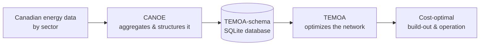

# What is CANOE?

The **Can**adian **O**pen **E**nergy model answers the question:

> Given how much energy Canada will need in the future, what's the cheapest combination of
> technologies to build and operate to meet it?

CANOE is a **capacity expansion model**: a tool that looks at projected energy demand (electricity,
heating, transportation, industrial processes, and so on) and calculates the lowest-cost mix of power
plants, vehicles, heating systems, and other technologies needed to satisfy that demand, year by year,
subject to constraints like emissions targets or resource availability.

!!! tip "Glossary"
    If a term is unfamiliar, check the [Glossary](glossary.md).

## CANOE and TEMOA

CANOE isn't a solver by itself, but a **Canadian dataset**, built to plug into
[TEMOA](https://temoacloud.com/), an open-source optimization framework that performs the actual optimization.

- **Open Data**: Canadian and US sources describing energy demand and technology options across
  electricity, transportation, industry, residential, commercial, and fuels.
- **CANOE pipeline**: aggregate, clean, and structure that data into the schema TEMOA expects.
- **TEMOA**: takes that structured data and formulate a linear programming model that solves for the cost-optimal way to meet demand.
  TEMOA treats the energy system as a **network** of technologies connected through energy flows (commodities). `pyomo` is used under the hood to connect to a open-source or proprietary solver.
- **Output**: is written to the same database, into tables containing the optimized results:
  what gets built, when, and how it's operated at a high-level.

## What CANOE covers

CANOE represents the Canadian energy system across five end-use sectors:

- **Agriculture**
- **Industry**
- **Residential**
- **Commercial**
- **Transportation**

Additionally, two modules build the backbone that connects all the end-use sectors together and add additional information:

- **Electricity** — generation and distribution
- **Fuels** — production, import, and pricing that ties the other sectors together

Each sector is, at its core, a model of end-use demand. Some simple (a single aggregate demand
number), others with levers that shift both the amount and the type of demand (for example, how many
electric vehicles versus internal combustion vehicles are on the road). The [Model
Architecture](model_architecture.md) page goes into how these sectors connect to each other.

## Where to go next

-   :material-swap-horizontal:{ .lg .middle } **CANOE vs. TEMOA**

    ---

    What each project is responsible for, and how they're versioned together.

    [:octicons-arrow-right-24: Read more](canoe_vs_temoa.md)

-   :material-sitemap:{ .lg .middle } **Model Architecture**

    ---

    How sectors, linker modules, and the database schema fit together.

    [:octicons-arrow-right-24: Read more](model_architecture.md)

-   :material-book-alphabet:{ .lg .middle } **Glossary**

    ---

    Plain-language definitions of capacity-expansion and TEMOA terms.

    [:octicons-arrow-right-24: Read more](glossary.md)

Ready to run it yourself instead? Head to [Get Started](../get_started.md).
