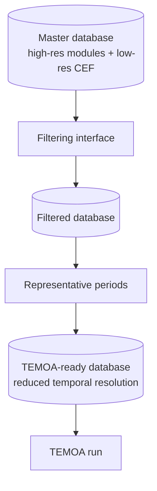

# Model Architecture

This page covers how CANOE is structured internally: how sectors relate to each other, how their
output comes together into a single database, and what happens to that database before it's ready
for TEMOA to run.

## Sectors as demand models

CANOE is organized into seven sectors: Electricity, Agriculture, Transportation, Industry, Residential,
Commercial, and Fuels. At their core, each sector is a model of **end-use demand**: how much energy
(and what kind) is needed to meet Canadians' needs over time.

Sectors vary in complexity:

- Some represent demand as a simple aggregated values per period.
- Others include **levers** that shift both the *amount* and the *type* of demand — for example, how
  many electric vehicles versus internal-combustion vehicles are on the road, which changes both
  total energy demand and which fuel/commodity it falls on. These are often technologies that the model
  can scale up or down to meet demand.

## Linker modules

Fuel and Electricity play a different role from the other sectors: rather than representing an end-use
demand on their own, they act as **linkers**, tying the sector demand models to energy prices,
imports, and distribution.

!!! info "Electricity's dual role"
    Electricity currently covers both generation and distribution in one module. Separating generation
    out as its own concern is being discussed but not yet implemented.

## From sectors to a master database

Each sector and linker module writes into a shared SQLite database following the TEMOA/CANOE
schema (see [CANOE vs. TEMOA](canoe_vs_temoa.md)). CANOE compiles all of this into a single
**master database**.

Within that master database, each sector's demand is represented at **two different resolutions**,
side by side:

- **High resolution** — the sector modules' own bottom-up output: the detailed, module-by-module
  demand and technologies data described above.
- **Low resolution** — an alternative built from [CEF](../data_guide/cef.md) (Canada's Energy
  Future) projections, a coarser, top-down aggregate view of the same demand.

Both versions live in the master database at once. Choosing between them is part of what the filtering step below does.

!!! info "Why two resolutions"
    The low resolution sectors significantly reduce the computational complexity of experiments. They can be used to assess changes in one sector while keeping a reasonable pressure from the rest of the modules.

## Filtering and representative periods

Before a run, the master database goes through two narrowing steps:

- **Filtering interface** — narrows the master database down to a specific case of interest: which provinces,
  which scenario, and which resolution track (high-res module output or low-res CEF) to use for each
  sector, rather than the full compiled dataset.
- **Representative periods** — often 365 days per year of *temporal* resolution is finer than what
  TEMOA can practically optimize, so this step reduces it to a manageable set of representative
  time periods before the run.

Both steps are necessary today because TEMOA can't optimize efficiently against the full master
database directly. They're called out separately here because they show up as distinct stages
throughout the docs (and as distinct tools/repos) — the [Get Started](../get_started.md) guide
covers how to actually run them.

## Where to go next

-   :material-book-alphabet:{ .lg .middle } **Glossary**

    ---

    Plain-language definitions of capacity-expansion and TEMOA terms.

    [:octicons-arrow-right-24: Read more](glossary.md)

[:octicons-arrow-left-24: Back to What is CANOE](index.md)
